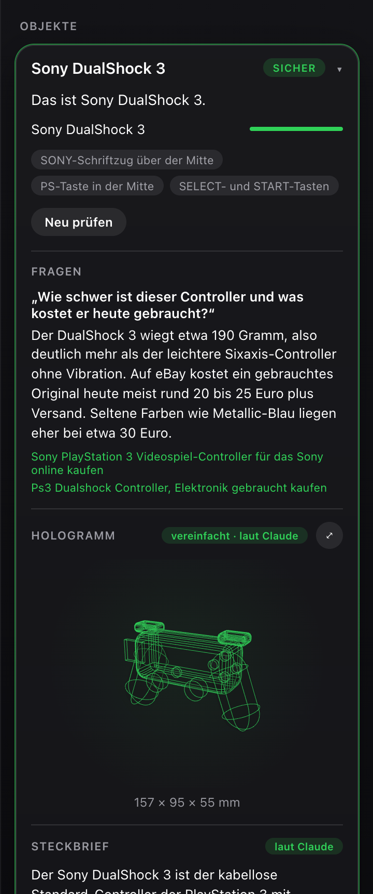
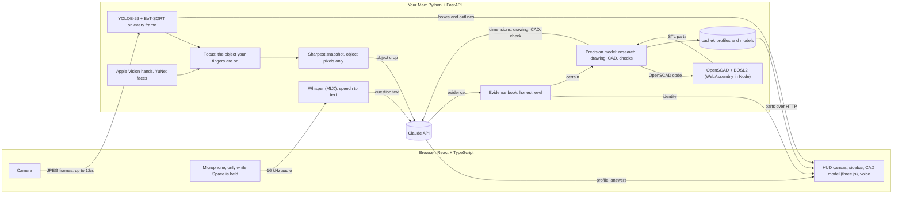

# Object Intelligence

Hold any object up to your Mac's camera. Object Intelligence finds the thing in your hand, tells you honestly how
sure it is what it is, researches its exact dimensions and builds a CAD model of it, and answers questions you ask
out loud.




Most "what is this?" tools send a photo to a model and print whatever comes back. Object Intelligence is built the
other way round:

- **A local pipeline does the seeing.** A detector and tracker run on every frame on the Mac. Apple Vision finds your
  hand, and only the object your fingers lie on is identified.
- **Claude does the knowing.** It gets a crop with nothing but the object. It returns structured evidence, not a
  verdict.
- **An evidence book decides.** It turns several views into an honest level: *certain*, *likely*, *unsure* or
  *category only*. When two products look alike, the entry says so and asks for the side that tells them apart.

Everything is in German by default (`OI_LANGUAGE=en` switches to English). The pictures in this README show the real
precision model of an iPhone 14: researched by Claude, built from Apple's dimensional drawing, compiled with
OpenSCAD, checked twice (25 parts, 0.90 $).

<br clear="right">

## What it does

The project was built in six sub-projects, each with its own design document:

1. **See and identify.** YOLOE-26 (open vocabulary, prompt-free) and BoT-SORT track everything in view. Apple Vision
   confirms your hands and outlines them. The object with at least three finger joints on it gets the green box.
   - A snapshot, the sharpest frame of half a second, goes to Claude.
   - The first seconds calibrate the background: lamps, shelves and stairs are named once and frozen. They never steal
     the focus.
   - Your face, hair, glasses, shirt and necklace are never marked.
2. **Product profile.** Once an object is at least *likely*, it gets a short description and 4 to 8 technical facts.
   Release date, launch price and a few things worth knowing follow. It all comes from Claude's own knowledge and is
   always marked *laut Claude*.
3. **Sidebar.** Every identified object stays pinned in the sidebar. The one in your hand is expanded and linked to
   its box. (Its first hologram, a model from 16 primitives, was replaced by the precision model of sub-project 6.)
   - Two tracks of the same physical object are merged after one small comparison.
   - If an object stays *unsure*, you tap the right candidate and it becomes *certain*, marked *von dir bestätigt*.
4. **Questions by voice.** Hold the space bar, ask ("Wie schwer ist dieser Controller?") and let go.
   - Whisper (MLX) turns your voice into text on the Mac.
   - Claude answers in one to three sentences. It searches the web only when the question needs something current,
     such as a price, and then names its sources.
   - The answer is read aloud.
5. **Polish.** The interface is dark Apple glass.
   - "⤢" on the model opens it in full screen, with measure lines for width, height and depth and a numbered tag on
     every part. The parts list, the dimensions with their sources, the profile and the trivia sit beside it.
   - You can start the whole program with a double-click.
6. **Precision model.** Once an object is *certain*, the model is built from sources instead of from memory.
   - **Research:** Claude searches the manufacturer's data sheets and technical drawings. Every dimension keeps its
     source and kind: from a drawing, from a data sheet, or estimated.
   - **Drawing:** If there is a dimensional drawing (Apple publishes one per device), the server downloads the PDF,
     finds the page and shows it to Claude as an image.
   - **CAD:** Claude writes an OpenSCAD program with BOSL2: rounded edges, cut-outs, turned parts, one module per part.
     OpenSCAD runs as WebAssembly in Node, sealed off from the Mac's files.
   - **Check:** The server renders the model from four sides, and Claude compares it with the drawing and the photo and
     corrects it, in up to two rounds.
   - **Cache:** The result is kept per product, so the next time it appears at once and for free.

## Principles

- **Levels, not fake percentages.** A number a language model makes up ("87 %") is not a measured probability. The
  interface shows levels, and exact shares appear only in the telemetry corner (`D`). A result becomes *certain* only
  in three ways: through two independent views, through a model name readable on the object, or through your own tap.
- **Privacy by construction.**
  - What goes to Claude is the object alone: everything outside its outline is painted grey.
  - A crop that could show a person is never sent. Faces are found locally (OpenCV YuNet) and never leave the Mac.
  - The one whole frame that is sent, for naming the background, has every person painted grey first.
  - Your voice is transcribed on the Mac; only the text of the question leaves it.
- **Costs are bounded and visible.** At most 4 calls per object and 150 per session, answers included. A precision
  model may cost at most 1.60 $ (about 1.50 €), and at most 5 new ones are built per session. Every call is logged in
  `runs/` with its crop, answer, tokens, cost and latency. Profiles and precision models are cached per model in
  `cache/`, so each is paid once, ever. The default model is Claude Sonnet 5.5 with effort *high*: one
  identification took 6 s and 0.77 ct. The table was measured with Claude Opus 5.5:

  | Call | Cost | Time |
  |---|---|---|
  | Identify the object in your hand | 1.3–1.7 ct | 6–10 s |
  | Profile | about 1.2 ct | 6 s |
  | Precision model (research, CAD, checks; once per product) | 0.40–0.90 $ | 2.5–4.5 min |
  | "Is this the same object?" | 0.4–0.5 ct | 3–5 s |
  | Spoken question | about 3 ct | 4 s |
  | Spoken question with web search | about 10 ct | 14–35 s |

  A web search is expensive because the pages it finds add about 20,000 input tokens, so an answer may search only
  once.

## How it works



The decision logic is plain Python with unit tests: focus, snapshots, trigger, evidence book, privacy rules and
merging. The detector, Claude and Whisper sit behind small interfaces with fakes, so the whole pipeline is tested
without a camera, a model or a network. Browser and server talk over one WebSocket with typed messages; a JSON
fixture keeps both sides of the protocol in step.

**Stack.**
- **Server:** Python 3.12 with uv, FastAPI and uvicorn. Ultralytics YOLOE-26 with BoT-SORT, Apple Vision through
  PyObjC, OpenCV YuNet and mlx-whisper (`whisper-large-v3-turbo`).
- **Claude:** the Anthropic SDK with structured outputs, the web search and the web fetch tool.
- **CAD:** OpenSCAD 2025 as WebAssembly (`openscad-wasm-prebuilt`, Manifold kernel) with BOSL2, run by Node;
  pypdfium2 for drawing pages; matplotlib for the check views.
- **Browser:** React 19 with TypeScript, zustand, Vite and three.js; an AudioWorklet records the microphone.
- **Tests:** pytest and Vitest.

## Start

macOS on Apple Silicon with [uv](https://docs.astral.sh/uv/) and [Node.js](https://nodejs.org) (Node also runs the
OpenSCAD compiler of the precision model):

```bash
uv sync
npm --prefix web install
cp .env.example .env   # then put your Anthropic API key into .env (it never goes into git)
```

Then double-click **`Object Intelligence.command`** in Finder. It builds the browser part when needed, starts the
server and opens http://127.0.0.1:8766. If the app is already running, it only opens the browser. From a terminal:

```bash
uv run python -m oi                 # the same, without the build step
uv run python -m oi --no-browser --port 8799
```

On the first start the YOLOE weights download (about 38 MB), and so do the Whisper model (about 1.5 GB) and the
BOSL2 library for OpenSCAD (a pinned version, about 3 MB). The
browser asks for the camera at once and for the microphone the first time you hold Space. Without an API key the app
runs in local mode with boxes, IDs and coarse labels only.

| Key | |
|---|---|
| hold `Space` | ask a question about the object in your hand (or the last opened entry) |
| `M` | voice on or off (answers to your questions are always read aloud) |
| `D` | telemetry: frame rates, latencies, calls, costs and exact shares |
| `S` | mirror view |
| `R` | calibrate the background again |
| `Esc` | close the full-screen model |

Settings such as `OI_MODEL=claude-opus-5-5`, `OI_EFFORT=low`, `OI_LANGUAGE=en` or `OI_MAX_CALLS_SESSION` are read from the
environment or `.env`.

## Tests

```bash
uv run pytest               # 328 tests: all logic, no model, no network
uv run pytest -m model      # loads the real YOLOE weights
uv run pytest -m scad       # the real OpenSCAD compiler, including its sandbox
uv run pytest -m claude     # real Claude calls (a research call costs about 20–40 cents)
npm --prefix web test       # 55 tests: geometry, sidebar state, model maths, voice and labels
```

`--fake-claude` gives canned answers without any API call. It exists for the automated tests; real identification
needs Claude.

## Documents

[`ERKLAERUNG.md`](ERKLAERUNG.md) explains the whole project in German: what happens, how and why, step by step,
with the bugs found on the way and reading exercises.

| Sub-project | Design | Plan |
|---|---|---|
| 1 See and identify | [spec](docs/superpowers/specs/2026-09-30-see-and-identify-design.md) | [plan](docs/superpowers/plans/2026-09-30-see-and-identify.md), [acceptance](docs/acceptance/sp1-checklist.md) |
| 2 Product profile | [spec](docs/superpowers/specs/2026-10-01-product-profile-design.md) | [plan](docs/superpowers/plans/2026-10-01-product-profile.md) |
| 3 Hologram and sidebar | [spec](docs/superpowers/specs/2026-10-01-hologram-design.md) | [plan](docs/superpowers/plans/2026-10-01-hologram.md) |
| 4 Questions by voice | [spec](docs/superpowers/specs/2026-10-01-questions-voice-design.md) | |
| 5 Polish and portfolio | [spec](docs/superpowers/specs/2026-10-01-polish-design.md) | |
| 6 Precision model | [spec](docs/superpowers/specs/2026-10-01-precision-model-design.md) | [plan](docs/superpowers/plans/2026-10-01-precision-model.md) |

## License

[AGPL-3.0](LICENSE). The detector, YOLOE by Ultralytics, is itself licensed under AGPL-3.0.
